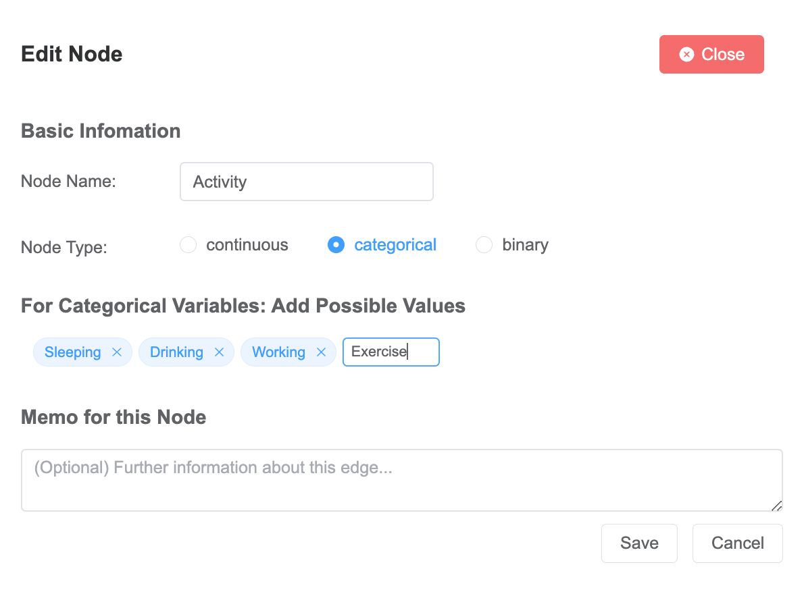

# APIs and User Interface for Graphical Time Series

## Introduction

This repository is meant for non-technicals to create, modify and simulate graphical time series. The initial commits contains demonstration of the basic APIs and how to use it in a web app, which is implemented in Vue3.

## Components

* APIs: Contains the basic APIs to manipulate the dynamic graphical causal model. The APIs are implemented with Flask in python.
* Interface: Contains a Vue3 project that demonstrates how to use the APIs in an Web App. The requests are handled with Axios.

## Concept
We define the knowledge as expert edge. It means the connection between two variables with options that define the mapping from one to the other.

### Node

There are three types of nodes: `categorical`, `binary`, `continuous`

For all types of node, one should specify the name, and the type. 

* For `categorical` variable, the possible values should be listed in the tag section like shown:

* For `continous` variable, the range of this variable should be specified. Optionally, you can specify an offset which means a common value of this variable. 

* For `binary` varible, no extra input is required. 

* As you can see, a memo can be provided for extra information for a node.

### Edge

#### Basic Information
For an edge, we are interested in the lag of the effect, which means the latency between the triggering value in the source node and the triggered value in the target node.

If the triggering event is a sequence rather than a value, you can indicate this fact by inputing a input length > 1. This is however impossible for an edge targeting discrete variables.

#### Edge Types
Edge types are determined by the source type and the target type. Since we have three node types, there are totally $3^2 = 9$ types of edges.

* `continous` to `continous` 
  * This type of edge is designed to be a change to change mapping. That means the relationship indicates whether rise / fall in the source node will trigger rise / fall in the target node.
  * There are various setting modes: `gradient`, `addtion`, `difference`, `value`. `gradient` means the target node will be controlled by a sequence of gradient driving it up / down. `addition` means the effect will be superposed on the effects from the other sources. `difference` means the effect will be a difference value to the history. And `value` means the result will be directly set to upcoming time slots. As you might notice there are some overlaps between difference and gradient. Removing one of them properly will be a todo for this project.
  * `scale` should be set to indicate how significant the effect will be. There are two directions: Positive and Negative. For example the volume of sweating will lower the temperature, so an edge like this should have a negative scale. 

* `categorical` to `continuous`
  * Mapping from discrete categories to continuous variable. The latter responses to the switch of the former. The switch to the same category will trigger the same effect, no matter what its original category is.
  * Configuration for this edge type is featured with different scales for each category.

* `binary` to `continuous`
   * The continuous target will repsonses to the switch from 0 and 1 to otherwise.

* `continuous` to `categorical`
   * The range of the source variable will be splitted into intervals. Each interval corresponds to one category. User will be asked to define the separators, therefore the intervals will have no gap between one another.

* `categorical` to `categorical`
   * This edge type is trivial. It simply map one category of the source to one and only one category of the target.
 
* `binary` to `categorical`
   * This edge type is defined by assigning 0 / 1 to one category respectively.
 
* `

## Usage

### Option 1: Upload and manipulate 

### Option 2: Create from scratch

## Demostration

